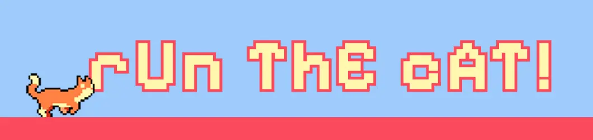
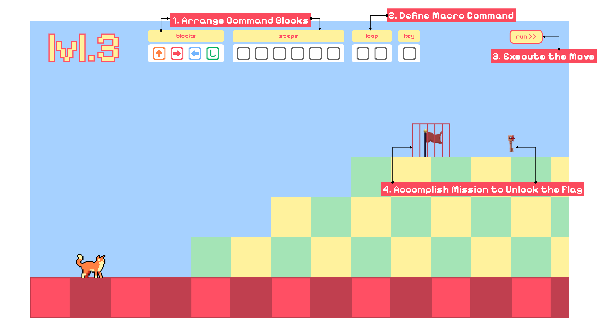

<div style="display: flex; justify-content: center; align-items: center; gap: 8px;">
  <a href="https://github.com/nadiarvi/run-the-cat">
    
  </a>
  <a href="https://www.youtube.com/">
    
  </a>
</div>

# 🐱 Run The Cat 

### 👩‍💻 Student Information
Name : Nadia Azzahra Putri Arvi  
Student ID : 20210747  
Email : nadia.arvi@kaist.ac.kr 

## Table of Contents
- [🐱 Run The Cat](#-run-the-cat)
    - [👩‍💻 Student Information](#-student-information)
  - [Table of Contents](#table-of-contents)
  - [🎮 Game Description](#-game-description)
    - [How It Works](#how-it-works)
  - [⚙️ Running The Game](#️-running-the-game)
  - [🔧 Code Organization](#-code-organization)
    - [Core Components](#core-components)
  - [🐛 Known Issues](#-known-issues)
  - [✨ Special Features](#-special-features)
  - [📦 Tech Stack \& Resources](#-tech-stack--resources)
    - [🔧 Built With](#-built-with)
    - [🕹️ Game Framework \& Libraries](#️-game-framework--libraries)
    - [🎨 Assets Used](#-assets-used)
  - [🐙💻 Repository Structure](#-repository-structure)
  - [🙏 Acknowledgements](#-acknowledgements)


## 🎮 Game Description
Run The Cat is a puzzle-platformer game where players guide a cat through various levels using coding-like commands. The game teaches basic programming concepts through interactive gameplay.

### How It Works
<div align="center">
  
  <p>Figure 1. A snapshot of the game interface showing key UI components.<br>
</div>

In this game, players must:
1. Select commands from the `blocks` panel — only these available blocks can be used.
2. Arrange the selected blocks into a sequence using the `steps` panel.
3. Define macro commands in the `loop` panel to optimize and reduce repetition.
4. Execute the move using the `run` button to guide the cat.
5. Collect keys and reach the flag to complete the level.

## ⚙️ Running The Game
To play the game, follow these steps:

1. Clone the repository
```bash
git clone https://github.com/nadiarvi/run-the-cat.git
```

2. Navigate to the project directory:
```bash
cd run-the-cat
```

3. Install dependencies and start the game:
```bash
npm install
npm start
```


## 🔧 Code Organization
### Core Components
Main Classes  
- `SceneManager`: Handles scene transitions and game state
- `Cat`: Controls player character physics and animations
- `Key`/`Flag`: Interactive level elements

## 🐛 Known Issues
- **Restart Bug**  
  After restarting a level, the cat's movement becomes slightly jittery, unlike on a fresh load. This is likely due to the sprite or state not being fully reset. A temporary fix is in place, but it may still cause minor visual glitches.

- **Clickable Background After Completion**  
  When a level is completed and the overlay is displayed, the background remains interactive. This allows players to accidentally trigger cat movement even though the game should not be playable.

## ✨ Special Features

_No additional features beyond the core requirements were implemented._


## 📦 Tech Stack & Resources

### 🔧 Built With

| Tech | Description |
|------|-------------|
|  | Markup structure |
|  | Styling and layout |
|  | Game logic and interactivity |
|  | Development tooling |

### 🕹️ Game Framework & Libraries

| Library | Purpose |
|---------|---------|
| [](https://p5js.org/) | Core game rendering and animation |
| [p5.SceneManager](https://github.com/mveteanu/p5.SceneManager) | Manage different game scenes and levels |
| [p5.clickable](https://github.com/Lartu/p5.clickable) | Create clickable UI elements (i.e. buttons) |
| [p5.play](https://p5play.org/) | Sprite handling and physics engine |

### 🎨 Assets Used

| Asset | Source & Credits |
|-------|------------------|
| 🐱 **Cat Sprite** | [Free Street Animal Pixel Art Asset Pack](https://craftpix.net/freebies/free-street-animal-pixel-art-asset-pack/?num=1&count=301&sq=cat&pos=4) by [CraftPix.net](https://craftpix.net) |
| 🚩 **Flag Animation** | [Free Flag with Animation](https://ankousse26.itch.io/free-flag-with-animation) by [ankousse26](https://ankousse26.itch.io) |
| 🔑 **Key Sprite** | [FREE Pixel Art Key Pack – Animated](https://karsiori.itch.io/pixel-art-key-pack-animated) by [karsiori](https://karsiori.itch.io) |

## 🐙💻 Repository Structure

```bash
run-the-cat/
├── README.md
├── index.html                   # Main HTML file to load the game
├── lib/                         # External libraries (p5.js, SceneManager, etc.)
│   ├── p5.clickable.js          
│   ├── p5.js                    
│   ├── scenemanager.js          
│   └── scenemanager_.js         
├── package.json                 # Project metadata and dependencies
├── public/
│   └── assets/                  # Images, sprites, and other media assets
└── src/                         # Main source code
    ├── components/              # Reusable game components (Cat, Flag, etc.)
    ├── main.js                  # Game entry point
    ├── scenes/                  # Level or scene logic
    ├── style.css                # Styles for the game UI
    └── utils/                   # Utility functions and UI helpers
```

- `index.html`: The entry point of the application, loading scripts and setting up the canvas.
- `lib/`: Contains third-party libraries such as p5.js, p5.clickable, and p5.SceneManager used to build game mechanics and UI. Some libraries are modified for compatibility.
- `public/assets/`: Stores game-related assets, including images, sprites, and screenshots used in the README.
- `src/`: 
  - `components/`: Contains the constructor of individual game elements. (e.g. `Cat`, `Key`, `Flag`)
  - `scenes/`: Defines the logic for different game levels using p5.SceneManager.
  - `utils/`: Provides shared helpers and UI tools such as common styling and themes.
  - `main.js`: Initializes the game, sets up the canvas, and starts the first scene.
  - `style.css`: Contains global styling HTML file.

## 🙏 Acknowledgements

All assets and libraries used have been credited in the [📦 Tech Stack & Resources](#-tech-stack--resources) section above. Code examples were referenced from the official documentation of the respective libraries. LLMs were used for debugging assistance.


<!-- 📝 Development Notes
This project uses:

p5.js for rendering
Scene management for level organization
Sprite-based animation system
Physics engine for realistic movement
Control Flow -->
<!-- 
## 🎯 Future Improvements
<input disabled="" type="checkbox"> Add more levels
<input disabled="" type="checkbox"> Implement save system
<input disabled="" type="checkbox"> Add sound effects
<input disabled="" type="checkbox"> Optimize physics calculations -->

